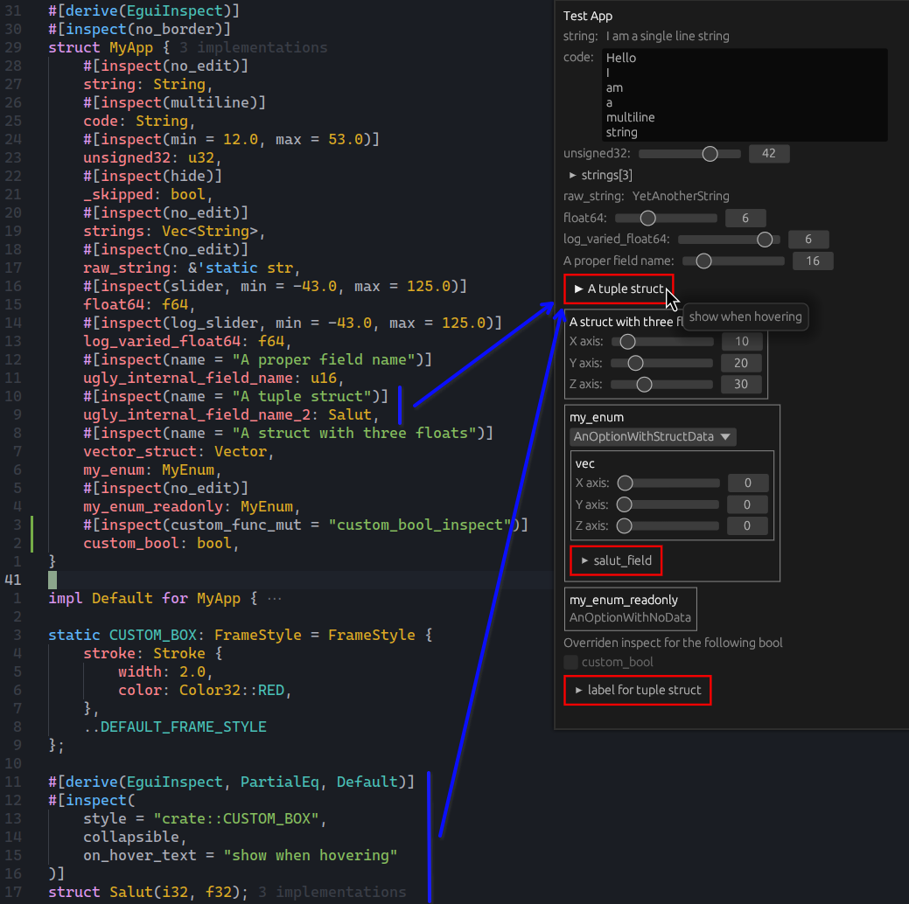

# egui_inspect

This is a fork of [egui_inspect](https://github.com/Meisterlama/egui_inspect).

Seeks to derive a graphical interface mostly from annotations on the structs we wish to expose.



To use this fork, add the following to your `Cargo.toml`.

```toml
[dependencies]
egui_inspect = { git = "https://github.com/dmirauta/egui_inspect" }
egui_inspect_derived = { git = "https://github.com/dmirauta/egui_inspect" }
```
