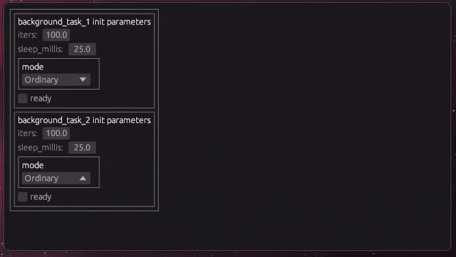

# egui_inspect

This is a fork of [egui_inspect](https://github.com/Meisterlama/egui_inspect).

Seeks to derive a graphical interface mostly from some light annotations on the structs we wish to expose.

[Source code](egui_example/src/autoprogress.rs)  |  Result
:-----------------------------------------------:|:-------------------------:
          |  

See [examples](./egui_example/) for more.

To use this fork, add the following to your `Cargo.toml`.

```toml
[dependencies]
egui_inspect = { git = "https://github.com/dmirauta/egui_inspect", branch="0_31" }
# egui_inspect_wrap = { git = "https://github.com/dmirauta/egui_inspect", branch="0_31" } # add separately if required
```

The `egui_inspect_wrap` subcrate allows one to side-step the orphan rule[^1], by allowing one to quickly define local copies of externally defined structs (that mirror public fields), shadowing the original (with `from` and `into` methods), so that one can derive ui for external structs.

[^1] One cannot define an external trait on an external struct.
